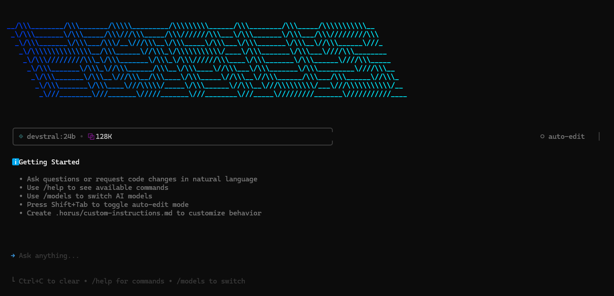

# Horus CLI

Un outil CLI d'IA conversationnelle alimenté par Horus avec des capacités d'édition de texte intelligente et d'utilisation d'outils.



## Fonctionnalités

- **🤖 IA Conversationnelle** : Interface en langage naturel alimentée par Horus-3
- **📝 Opérations de Fichiers Intelligentes** : L'IA utilise automatiquement des outils pour afficher, créer et modifier des fichiers
- **⚡ Intégration Bash** : Exécuter des commandes shell via une conversation naturelle
- **🔧 Sélection Automatique d'Outils** : L'IA choisit intelligemment les bons outils pour vos demandes
- **🚀 Morph Fast Apply** : Édition de code à haute vitesse optionnelle à 4,500+ tokens/sec avec 98% de précision
- **🔌 Outils MCP** : Étendre les capacités avec des serveurs Model Context Protocol (Linear, GitHub, etc.)
- **💬 Interface Interactive** : Belle interface terminal construite avec Ink
- **🌍 Installation Globale** : Installez et utilisez partout avec `bun add -g @vibe-kit/horus-cli`

## Installation

### Prérequis
- pnpm 9+ (recommandé), Bun 1.0+, ou Node.js 18+
- (Optionnel) Clé API pour votre fournisseur d'IA (Ollama n'en nécessite pas)
- (Optionnel, Recommandé) Clé API Morph pour l'édition Fast Apply
- **WSL2** : Entièrement compatible (voir `CORRECTIF_WSL2.md` pour les détails)

### Installation Globale (Recommandé)
```bash
bun add -g @vibe-kit/horus-cli
```

Ou avec npm (solution de repli) :
```bash
npm install -g @vibe-kit/horus-cli
```

### Développement Local
```bash
git clone <repository>
cd horus-cli
pnpm install  # Ou : bun install
bun run build
bun link
```

## Configuration

1. (Optionnel) Obtenez votre clé API auprès de votre fournisseur d'IA. Pour Ollama (par défaut), aucune clé API n'est nécessaire.

2. Configurez votre clé API si nécessaire (choisissez une méthode) :

**Méthode 1 : Variable d'Environnement**
```bash
export HORUS_API_KEY=your_api_key_here
```

**Méthode 2 : Fichier .env**
```bash
cp .env.example .env
# Éditez .env et ajoutez votre clé API
```

**Méthode 3 : Paramètre en Ligne de Commande**
```bash
horus --api-key your_api_key_here
```

**Méthode 4 : Fichier de Paramètres Utilisateur**
Créez `~/.horus/user-settings.json` :
```json
{
  "apiKey": "your_api_key_here"
}
```

3. (Optionnel, Recommandé) Obtenez votre clé API Morph depuis le [Tableau de bord Morph](https://morphllm.com/dashboard/api-keys)

4. Configurez votre clé API Morph pour l'édition Fast Apply (choisissez une méthode) :

**Méthode 1 : Variable d'Environnement**
```bash
export MORPH_API_KEY=your_morph_api_key_here
```

**Méthode 2 : Fichier .env**
```bash
# Ajoutez à votre fichier .env
MORPH_API_KEY=your_morph_api_key_here
```

### URL de Base Personnalisée (Optionnel)

Par défaut, le CLI utilise Ollama à `http://localhost:11434/v1`. Vous pouvez configurer un endpoint personnalisé si nécessaire (choisissez une méthode) :

**Méthode 1 : Variable d'Environnement**
```bash
export HORUS_BASE_URL=https://your-custom-endpoint.com/v1
```

**Méthode 2 : Paramètre en Ligne de Commande**
```bash
horus --api-key your_api_key_here --base-url https://your-custom-endpoint.com/v1
```

**Méthode 3 : Fichier de Paramètres Utilisateur**
Ajoutez à `~/.horus/user-settings.json` :
```json
{
  "apiKey": "your_api_key_here",
  "baseURL": "https://your-custom-endpoint.com/v1"
}
```

## Fichiers de Configuration

Horus CLI utilise deux types de fichiers de configuration pour gérer les paramètres :

### Paramètres au Niveau Utilisateur (`~/.horus/user-settings.json`)

Ce fichier stocke les **paramètres globaux** qui s'appliquent à tous les projets. Ces paramètres changent rarement et incluent :

- **Clé API** : Votre clé API (optionnelle pour Ollama)
- **URL de Base** : Endpoint API personnalisé (par défaut : Ollama à `http://localhost:11434/v1`)
- **Modèle par Défaut** : Votre modèle préféré (ex. `devstral:24b`)
- **Modèles Disponibles** : Liste des modèles que vous pouvez utiliser

**Exemple (Ollama - par défaut) :**
```json
{
  "baseURL": "http://localhost:11434/v1",
  "defaultModel": "devstral:24b",
  "models": [
    "devstral:24b",
    "deepseek-coder-v2:16b",
    "qwen2.5-coder:14b",
    "deepseek-coder:33b",
    "qwen2.5-coder:32b"
  ]
}
```

### Paramètres au Niveau Projet (`.horus/settings.json`)

Ce fichier stocke les **paramètres spécifiques au projet** dans votre répertoire de travail actuel. Il inclut :

- **Modèle Actuel** : Le modèle actuellement utilisé pour ce projet
- **Serveurs MCP** : Configurations des serveurs Model Context Protocol

**Exemple :**
```json
{
  "model": "deepseek-coder-v2:16b",
  "mcpServers": {
    "linear": {
      "name": "linear",
      "transport": "stdio",
      "command": "npx",
      "args": ["@linear/mcp-server"]
    }
  }
}
```

### Fonctionnement

1. **Par Défaut Globaux** : Les paramètres au niveau utilisateur fournissent vos préférences par défaut
2. **Surcharge Projet** : Les paramètres au niveau projet remplacent les valeurs par défaut pour des projets spécifiques
3. **Spécifique au Répertoire** : Lorsque vous changez de répertoire, les paramètres du projet sont chargés automatiquement
4. **Logique de Repli** : Modèle projet → Modèle par défaut utilisateur → Par défaut système (`devstral:24b`)

Cela signifie que vous pouvez avoir différents modèles pour différents projets tout en maintenant des paramètres globaux cohérents comme votre clé API.

### Utilisation d'Autres Fournisseurs d'API

**Important** : Horus CLI utilise des **API compatibles OpenAI**. Vous pouvez utiliser n'importe quel fournisseur qui implémente la norme de complétion de chat OpenAI.

**Fournisseurs Populaires** :
- **Ollama** : `http://localhost:11434/v1` (par défaut - modèles locaux, aucune clé API requise)
- **OpenAI** : `https://api.openai.com/v1`
- **OpenRouter** : `https://openrouter.ai/api/v1`
- **Groq** : `https://api.groq.com/openai/v1`

**Exemple avec OpenRouter** :
```json
{
  "apiKey": "your_openrouter_key",
  "baseURL": "https://openrouter.ai/api/v1",
  "defaultModel": "anthropic/claude-3.5-sonnet",
  "models": [
    "anthropic/claude-3.5-sonnet",
    "openai/gpt-4o",
    "meta-llama/llama-3.1-70b-instruct"
  ]
}
```

## Utilisation

### Mode Interactif

Démarrez l'assistant IA conversationnel :
```bash
horus
```

Ou spécifiez un répertoire de travail :
```bash
horus -d /path/to/project
```

### Mode Sans Interface

Traitez une seule commande et quittez (utile pour les scripts et l'automatisation) :
```bash
horus --prompt "show me the package.json file"
horus -p "create a new file called example.js with a hello world function"
horus --prompt "run bun test and show me the results" --directory /path/to/project
horus --prompt "complex task" --max-tool-rounds 50  # Limiter l'utilisation d'outils pour une exécution plus rapide
```

Ce mode est particulièrement utile pour :
- **Pipelines CI/CD** : Automatiser l'analyse de code et les opérations sur fichiers
- **Scripting** : Intégrer l'assistance IA dans les scripts shell
- **Benchmarks Terminal** : Parfait pour des outils comme Terminal Bench qui nécessitent une exécution non interactive
- **Traitement par Lots** : Traiter plusieurs commandes de manière programmatique

### Contrôle de l'Exécution d'Outils

Par défaut, Horus CLI autorise jusqu'à 400 cycles d'exécution d'outils pour gérer des tâches complexes en plusieurs étapes. Vous pouvez contrôler ce comportement :

```bash
# Limiter les cycles d'outils pour une exécution plus rapide sur des tâches simples
horus --max-tool-rounds 10 --prompt "show me the current directory"

# Augmenter la limite pour des tâches très complexes (utiliser avec prudence)
horus --max-tool-rounds 1000 --prompt "comprehensive code refactoring"

# Fonctionne avec tous les modes
horus --max-tool-rounds 20  # Mode interactif
horus git commit-and-push --max-tool-rounds 30  # Commandes Git
```

**Cas d'Usage** :
- **Réponses Rapides** : Limites plus basses (10-50) pour les requêtes simples
- **Automatisation Complexe** : Limites plus élevées (500+) pour des tâches complètes
- **Contrôle des Ressources** : Empêcher les exécutions incontrôlées dans des environnements automatisés

### Sélection de Modèle

Vous pouvez spécifier quel modèle d'IA utiliser avec le paramètre `--model` ou la variable d'environnement `HORUS_MODEL` :

**Méthode 1 : Paramètre en Ligne de Commande**
```bash
# Utiliser les modèles Ollama (par défaut)
horus --model devstral:24b
horus --model deepseek-coder-v2:16b
horus --model qwen2.5-coder:14b

# Utiliser d'autres modèles (avec l'endpoint API approprié)
horus --model gemini-2.5-pro --base-url https://api-endpoint.com/v1
horus --model claude-sonnet-4-20250514 --base-url https://api-endpoint.com/v1
```

**Méthode 2 : Variable d'Environnement**
```bash
export HORUS_MODEL=devstral:24b
horus
```

**Méthode 3 : Fichier de Paramètres Utilisateur**
Ajoutez à `~/.horus/user-settings.json` :
```json
{
  "apiKey": "your_api_key_here",
  "defaultModel": "devstral:24b"
}
```

**Priorité du Modèle** : Paramètre `--model` > Variable d'environnement `HORUS_MODEL` > Modèle par défaut utilisateur > Par défaut système (devstral:24b)

### Options de Ligne de Commande

```bash
horus [options]

Options:
  -V, --version          afficher le numéro de version
  -d, --directory <dir>  définir le répertoire de travail
  -k, --api-key <key>    Clé API Horus (ou définir la variable d'env HORUS_API_KEY)
  -u, --base-url <url>   URL de base de l'API Horus (ou définir la variable d'env HORUS_BASE_URL)
  -m, --model <model>    Modèle d'IA à utiliser (ex. devstral:24b, deepseek-coder-v2:16b) (ou définir la variable d'env HORUS_MODEL)
  -p, --prompt <prompt>  traiter une seule commande et quitter (mode sans interface)
  --max-tool-rounds <rounds>  nombre maximum de cycles d'exécution d'outils (par défaut : 400)
  -h, --help             afficher l'aide pour la commande
```

### Instructions Personnalisées

Vous pouvez fournir des instructions personnalisées pour adapter le comportement de Horus à votre projet en créant un fichier `.horus/HORUS.md` dans le répertoire de votre projet :

```bash
mkdir .horus
```

Créez `.horus/HORUS.md` avec vos instructions personnalisées :
```markdown
# Instructions Personnalisées pour Horus CLI

Toujours utiliser TypeScript pour tout nouveau fichier de code.
Lors de la création de composants React, utiliser des composants fonctionnels avec des hooks.
Préférer les assertions const et le typage explicite à l'inférence lorsque cela améliore la clarté.
Toujours ajouter des commentaires JSDoc pour les fonctions et interfaces publiques.
Suivre le style de code et les patterns existants dans ce projet.
```

Horus chargera automatiquement et suivra ces instructions lorsque vous travaillez dans le répertoire de votre projet. Les instructions personnalisées sont ajoutées au prompt système de Horus et ont la priorité sur le comportement par défaut.

## Morph Fast Apply (Optionnel)

Horus CLI prend en charge le modèle Fast Apply de Morph pour l'édition de code à haute vitesse à **4,500+ tokens/sec avec 98% de précision**. C'est une fonctionnalité optionnelle qui fournit des capacités d'édition de fichiers ultra-rapides.

**Configuration** : Configurez votre clé API Morph en suivant les [instructions de configuration](#configuration) ci-dessus.

### Fonctionnement

Lorsque `MORPH_API_KEY` est configurée :
- **L'outil `edit_file` devient disponible** aux côtés de l'éditeur standard `str_replace_editor`
- **Optimisé pour les éditions complexes** : Utiliser pour les modifications multi-lignes, le refactoring et les modifications importantes
- **Édition intelligente** : Utilise un format d'édition abrégé avec des commentaires `// ... existing code ...`
- **Support de repli** : Les outils standards restent disponibles si Morph est indisponible

**Quand utiliser chaque outil :**
- **`edit_file`** (Morph) : Éditions complexes, refactoring, modifications multi-lignes
- **`str_replace_editor`** : Remplacements de texte simples, éditions d'une seule ligne

### Exemple d'Utilisation

Avec Morph Fast Apply configuré, vous pouvez demander des modifications de code complexes :

```bash
horus --prompt "refactor this function to use async/await and add error handling"
horus -p "convert this class to TypeScript and add proper type annotations"
```

L'IA choisira automatiquement entre `edit_file` (Morph) pour les modifications complexes ou `str_replace_editor` pour les remplacements simples.

## Outils MCP

Horus CLI prend en charge les serveurs MCP (Model Context Protocol), vous permettant d'étendre l'assistant IA avec des outils et capacités supplémentaires.

### Ajout d'Outils MCP

#### Ajouter un serveur MCP personnalisé :
```bash
# Ajouter un serveur MCP basé sur stdio
horus mcp add my-server --transport stdio --command "bun" --args server.js

# Ajouter un serveur MCP basé sur HTTP
horus mcp add my-server --transport http --url "http://localhost:3000"

# Ajouter avec des variables d'environnement
horus mcp add my-server --transport stdio --command "python" --args "-m" "my_mcp_server" --env "API_KEY=your_key"
```

#### Ajouter depuis une configuration JSON :
```bash
horus mcp add-json my-server '{"command": "bun", "args": ["server.js"], "env": {"API_KEY": "your_key"}}'
```

### Exemple d'Intégration Linear

Pour ajouter les outils MCP Linear pour la gestion de projet :

```bash
# Ajouter le serveur MCP Linear
horus mcp add linear --transport sse --url "https://mcp.linear.app/sse"
```

Cela active les outils Linear comme :
- Créer et gérer les issues Linear
- Rechercher et filtrer les issues
- Mettre à jour le statut et les assignés des issues
- Accéder aux informations d'équipe et de projet

### Gestion des Serveurs MCP

```bash
# Lister tous les serveurs configurés
horus mcp list

# Tester la connexion du serveur
horus mcp test server-name

# Supprimer un serveur
horus mcp remove server-name
```

### Types de Transport Disponibles

- **stdio** : Exécuter le serveur MCP comme sous-processus (le plus courant)
- **http** : Se connecter à un serveur MCP basé sur HTTP
- **sse** : Se connecter via Server-Sent Events

## Développement

```bash
# Installer les dépendances
pnpm install  # Ou : bun install

# Mode développement
bun run dev

# Construire le projet
bun run build

# Exécuter le linter
bun run lint

# Vérification de type
bun run typecheck
```

## Architecture

- **Agent** : Logique de traitement et d'exécution des commandes principales
- **Outils** : Implémentations d'éditeur de texte et d'outil bash
- **UI** : Composants d'interface terminal basés sur Ink
- **Types** : Définitions TypeScript pour l'ensemble du système

## Dépannage

### Erreur EPERM dans WSL2
Si vous rencontrez une erreur `EPERM: operation not permitted, read` lors de la première saisie, consultez `CORRECTIF_WSL2.md` pour la solution complète. Le correctif est déjà intégré dans le code.

### Ollama non accessible
```bash
# Vérifier si Ollama est en cours d'exécution
curl http://localhost:11434/v1/models

# Démarrer Ollama si nécessaire
ollama serve
```

### Problèmes d'affichage du terminal
```bash
# Réinitialiser l'état du terminal
reset
stty sane
```

### Mode sans interface (alternative)
Si le mode interactif pose problème :
```bash
horus --prompt "votre commande ici"
```

## Licence

MIT
